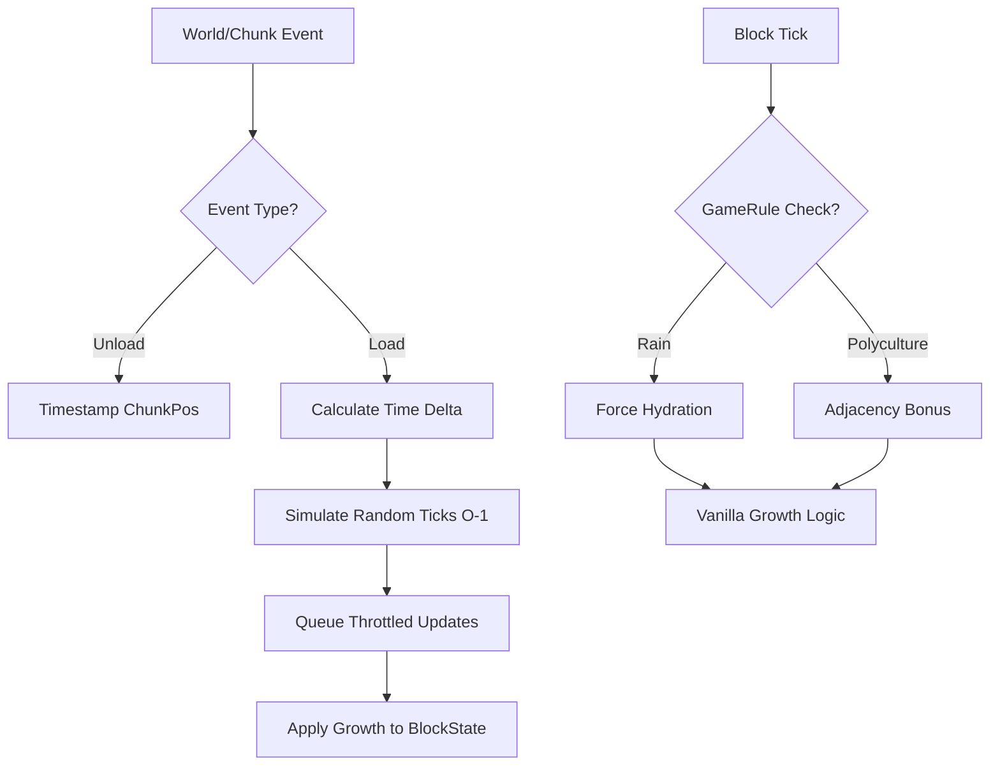

# Agrarian Reform Architecture

## System Overview
Agrarian Reform operates on a hybrid event-math model to ensure zero-lag synchronization of agricultural states across time deltas.

## Core Systems

### 1. The Continuum (Offline Manager)
- **Data Source**: `ContinuumData` (PersistentState).
- **Trigger**: `ServerChunkEvents.CHUNK_LOAD`.
- **Logic**: Mathematical approximation of random tick probability over a long time delta to prevent iterative loops.

### 2. Hydro-Dynamics
- **FarmlandBlockMixin**: Intercepts hydration checks to extend range based on water state (Source vs Flowing).
- **Weather Integration**: Dynamic hydration during rain events.

### 3. Polyculture Synergy
- **CropBlockMixin**: Injects adjacency checks into `getGrowthSpeed` to reward biodiversity.
